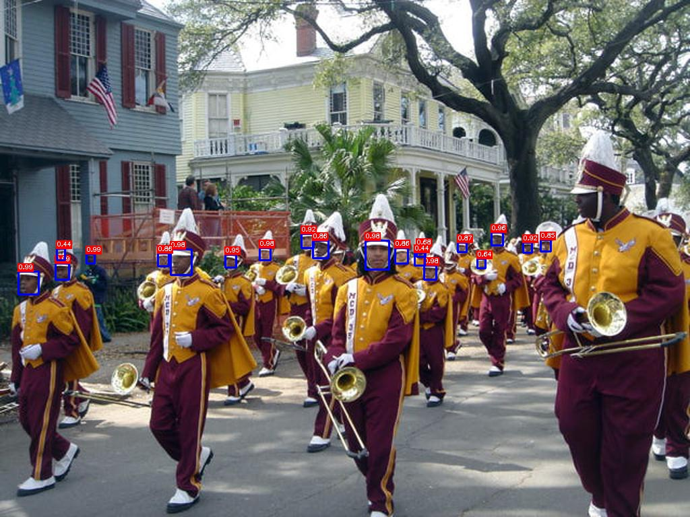
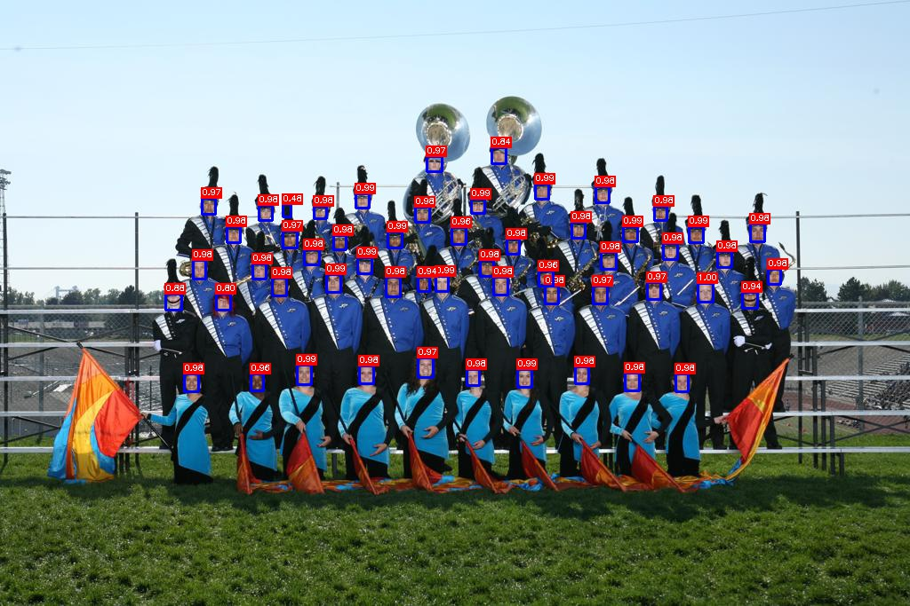

## EResFD ##
A PyTorch Implementation of "[Rediscovery of the Effectiveness of Standard Convolution for Lightweight Face Detection](https://arxiv.org/abs/2204.01209)", a real-time CPU face detector EResFD.

Joonhyun Jeong, Beomyoung Kim, Joonsang Yu, Youngjoon Yoo

### Performance
<div align="center">

</div>

- Comparison with other CPU-real time & GPU face detectors on WiderFace.

|             | Easy MAP | Medium MAP |  hard MAP | Latency (480x640) |
| --------    | ---------|------------| --------- | --------- |
| MTCNN | 0.851 | 0.820 | 0.607 | 4.0ms
| FaceBoxes | 0.885 | 0.862 | 0.773 | 35.7 ms
| RetinaFace (MobileNetV1) | 0.886 | 0.870 | **0.809** | 58.5ms
| EResFD-1x |	**0.890**    |    **0.879**   |  0.804    | 37.7 ms

### Prepare data 
1. download WIDER face dataset
2. ``` python3 prepare_wider_data.py```

### Evalution
according to yourself dataset path,modify data/config.py 
On widerface,
```
python3 test_wider.py --wider_root [widerface_directory] --model ./weights/eresfd_16.pth
```

### Demo 
you can test yourself image
```
python3 demo.py --model ./weights/eresfd_16.pth
```

### Result
<div align="center">


</div>

### License

```
EResFD
Copyright (c) 2022-present NAVER Corp.

Licensed under the Apache License, Version 2.0 (the "License");
you may not use this file except in compliance with the License.
You may obtain a copy of the License at

    http://www.apache.org/licenses/LICENSE-2.0

Unless required by applicable law or agreed to in writing, software
distributed under the License is distributed on an "AS IS" BASIS,
WITHOUT WARRANTIES OR CONDITIONS OF ANY KIND, either express or implied.
See the License for the specific language governing permissions and
limitations under the License.
```

### References
* [ssd.pytorch](https://github.com/amdegroot/ssd.pytorch)
